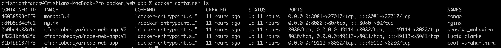

# ADVANCE ARCHITECTURE LABS

## LAB 1 - IBM Lab1 (FirstContainer)
https://ibm-developer.gitbook.io/docker101/docker-101/lab-1

### NGINX

### MongoDB

### Multiple Containers

## LAB 2 - NODE EXPRESS CART (SecondContainer)
https://github.com/mrvautin/expressCart/wiki

